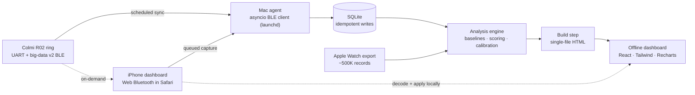

# Ring

**A local-first biometric platform built on top of a reverse-engineered $55 smart ring.**

Commercial rings (Oura, Ultrahuman) pair capable sensors with a locked ecosystem —
your data lives on their server, insights arrive as an opaque score, and real
access costs a subscription. The [Colmi R02](https://colmi.co/) uses comparable
hardware for a fraction of the price but ships an undocumented protocol and a
minimal companion app. This project reverse-engineers that protocol and builds
the entire stack on top of it — ingest, analysis, and an offline dashboard —
with no cloud service, no subscription, and no vendor app in the loop.

<!-- TODO: drop a screenshot or a short screen-recording GIF of the dashboard
     here (Today tab + a hypnogram make the best first impression). -->

## What it does

- Talks directly to the ring over Bluetooth LE — no vendor app, no cloud round-trip.
- Decodes sleep stages, HRV, SpO2, body temperature, heart rate, and steps from an
  undocumented protocol.
- Scores a daily readiness number against **your own** baseline, not a population
  average, and shows its confidence rather than hiding it.
- Runs the whole dashboard as one self-contained HTML file that works fully offline.
- Syncs two ways: an unattended Mac agent on a schedule, or on-demand straight from
  an iPhone in Safari — either path decodes locally and never depends on a server
  being reachable to be useful.

## Architecture

The Mac stays the authoritative store either way — a phone-side sync decodes and
displays locally first for responsiveness, then reconciles with the Mac in the
background. See [`docs/OFFLINE-DASHBOARD.md`](docs/OFFLINE-DASHBOARD.md) for why
that split exists and what it took to make it reliable.

## Protocol reverse engineering

The one prior open-source client ([`tahnok/colmi_r02_client`](https://github.com/tahnok/colmi_r02_client))
covered only heart rate and step counts. Everything else here was undocumented,
and a couple of published assumptions turned out to be wrong.

**Found a second, unused BLE service.** The community client speaks only the
Nordic-UART-style service. A second GATT service (`de5bf728-…`) carries a
"big data" protocol where sleep staging and SpO2 actually live — which is why
those metrics were widely assumed unavailable on this hardware.

**Decoded five undocumented data streams**, each validated against physiological
plausibility and a cross-referenced measurement before being trusted:

| Stream | How it was found |
|---|---|
| HRV history (cmd `0x39`) | Byte-level decode; constants later matched Gadgetbridge exactly |
| Stress history (cmd `0x37`) | Same; validated against a real-time read of the same metric |
| 4-stage sleep (big-data `0x27`) | Stage constants cross-referenced from Gadgetbridge source |
| SpO2 history (big-data `0x2a`) | Per-day record framing decoded from raw bytes |
| **Body temperature (big-data `0x25`)** | **Previously undocumented anywhere** — found scanning the big-data type space; scale confirmed against the vendor app |

The temperature channel appears in no public protocol documentation and isn't
implemented in Gadgetbridge, the most complete open-source client for this
device family.

A structural checksum — a sleep record's declared start/end must equal the sum
of its segment durations — caught a real decoding bug: a record header was 4
bytes, not 2, and the mis-read bytes had decoded as a *plausible* 2-minute sleep
segment on the first night sampled. It stayed invisible until a second night's
data produced an impossible stage value.

## Platform engineering

**Data pipeline.** Python/asyncio BLE client with a Hampel (median-absolute-
deviation) filter for PPG motion artifacts, gap-aware resampling that refuses to
interpolate across real gaps, and SQLite persistence with idempotent writes.
Outliers are *flagged*, never overwritten — raw readings are preserved.

**Analysis engine.** Personal-baseline modeling (z-scores and percentiles against
your own distribution, not population norms), transparent weighted scoring where
every component exposes its weight, confidence, and contribution, and a
confidence model that degrades explicitly when baselines are thin rather than
presenting a thinly-supported number as certain.

**Cross-device calibration.** Imports ~500K Apple Health records as a reference
track, comparing *matched hours* rather than daily totals — partial-wear days
are the norm, and comparing 6 hours of ring data against 24 hours of watch data
reads as a large fake undercount. Guards explicitly against seeding a baseline
across non-equivalent metrics (Apple records HRV as SDNN, the ring reports
RMSSD — a ~1.7× magnitude difference that would silently corrupt every reading).

**Frontend.** React 19, TypeScript, Tailwind v4, shadcn/ui, Recharts — compiled
to a single self-contained HTML file that works entirely offline. A six-tab
mobile interface with a WCAG-validated palette, programmatically checked for
colorblind separation and contrast in both light and dark themes.

**Infrastructure.** Fully automated collection: launchd agents for scheduled and
wake-triggered sync, plus private-network delivery over Tailscale so the phone
reaches the Mac from anywhere without exposing anything to the public internet.
A durable, crash-safe ingest queue on the Mac accepts phone-captured readings,
decodes them in an isolated worker, and retries transient failures on its own.

### Platform-level problems solved

- **macOS CoreBluetooth**: the BLE library couldn't reconnect once the OS held a
  link — the device stops advertising, and the library resolves addresses only by
  scanning. Fixed by retrieving the peripheral handle directly from CoreBluetooth
  and bypassing discovery.
- **TCC permissions**: background agents can't access protected directories or
  Bluetooth. Fixed by relocating the runtime and packaging the sync as a signed
  `.app` bundle launched through LaunchServices, giving macOS an identity to
  attach the Bluetooth grant to.
- **Architecture mismatch**: a universal-binary Python launched by LaunchServices
  could select the x86_64 slice, breaking arm64-only NumPy wheels — pinned the
  correct slice.
- **Diagnosed a macOS power-state constraint** (CoreBluetooth is unavailable
  during DarkWake) from `pmset` logs, correcting an earlier misdiagnosis and
  reshaping the sync strategy around it.
- **Safari has no Web Bluetooth.** Web Bluetooth doesn't ship in Safari, and a
  standalone home-screen PWA can't load a browser extension either — so on-demand
  phone sync runs through a Safari-extension bridge ([beacio](https://ioswebble.com/))
  from a normal Safari tab, while the home-screen icon stays fully usable for
  everything except capture.

## Design principle

The interface states its own limits. Interpolated points are visually distinct
from measurements, every score carries a confidence value, metrics computed by
inspectable firmware are labeled as such, and a "Known Limits" panel lists what
the system cannot do. Where a value couldn't be verified, it's stored raw and
left unconverted rather than displayed as a confident number.

## Stack

Python · asyncio · SQLite · pandas/NumPy · Bleak/CoreBluetooth · React 19 ·
TypeScript · Tailwind CSS v4 · shadcn/ui · Recharts · Vite · launchd · Tailscale

## Docs

| Doc | What's in it |
|---|---|
| [`PROTOCOL.md`](PROTOCOL.md) | The reverse-engineered BLE protocol itself |
| [`docs/OFFLINE-DASHBOARD.md`](docs/OFFLINE-DASHBOARD.md) | The offline/local-first architecture and the storage-split problem it solves |
| [`docs/TESTING.md`](docs/TESTING.md) | How the ingest pipeline and decode engine are tested |
| [`docs/WORK-STORY.md`](docs/WORK-STORY.md) | The engineering narrative — what broke, what it took to fix |

## Status

Personal, single-user project — not packaged for someone else to run without a
Colmi R02 ring and some setup. No license has been chosen yet.
